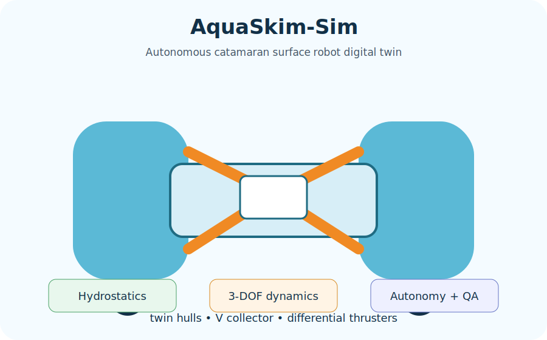
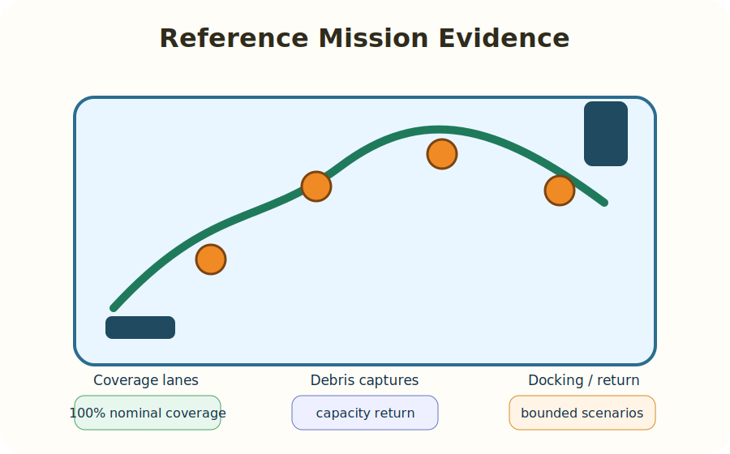
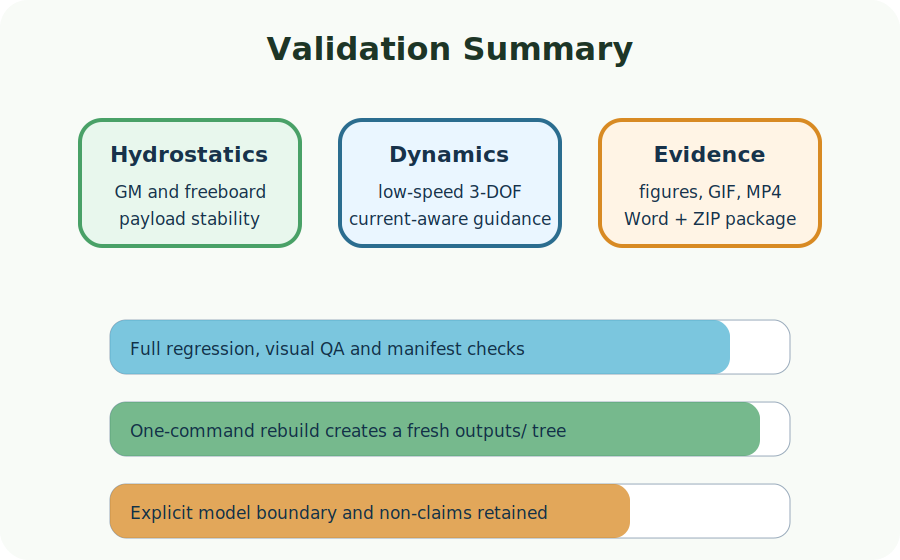

# AquaSkim-Sim

**AquaSkim-Sim** is an engineering simulation project for an autonomous catamaran surface robot that collects floating debris in calm water. The repository focuses on mechanical architecture, buoyancy and stability calculations, low-speed 3-DOF dynamics, current-aware control, mission validation and reproducible visual evidence.

> **Scope boundary:** this repository contains numerical simulation evidence only. It is not sea-trial footage, a certification package, wave-response validation, onboard current-estimator validation or hardware commissioning proof.

<p align="center">
  
  
  
</p>

The primary user guide is Persian: see [`README_FA.md`](README_FA.md). This English README is a compact companion.

## What a full rebuild produces

A clean rebuild creates a local `outputs/` folder containing:

- reference mission reports and CSV tables,
- engineering figures and design charts,
- GIF/MP4 visual evidence generated from simulation replay data,
- presentation evidence contact sheets,
- a final Word report in English,
- a final delivery ZIP with SHA-256 manifests.

Generated artifacts are intentionally ignored by Git. They are reproducible outputs, not source files.

## Prerequisites

Install these first:

1. **Git**, for cloning the repository.
2. **Miniconda** or **Mambaforge**, for creating the Python environment.
3. Windows 10/11 for the primary `.bat` workflow.

The project script creates or updates the Conda environment, installs dependencies, installs the package in editable mode, cleans previous local outputs and regenerates the full output tree. It does not install Git or Miniconda/Mambaforge for you.

## Quick start on Windows

```bat
git clone https://github.com/Hani-MSL/AquaSkim-Sim.git
cd AquaSkim-Sim
scripts\run_from_zero_to_delivery.bat
```

Expected final artifact:

```text
outputs\deliverables\AquaSkim-Sim_Final_Delivery_v1.6.21.zip
```

## Linux/macOS

```bash
git clone https://github.com/Hani-MSL/AquaSkim-Sim.git
cd AquaSkim-Sim
bash scripts/run_from_zero_to_delivery.sh
```

Windows is the primary evaluated path. The shell entry point also creates or updates the Conda environment before running the full rebuild.

## Repository layout

```text
src/aquaskim/      simulation, dynamics, control, reporting and packaging code
config/           versioned model and visualization configuration
tests/            regression and contract tests
scripts/          final public execution entrypoints
docs/             design, assumptions and reproducibility documentation
assets/           lightweight README showcase diagrams
outputs/          generated locally; ignored by Git
records/          generated locally; ignored by Git
```

## License

MIT License. See [`LICENSE`](LICENSE).
